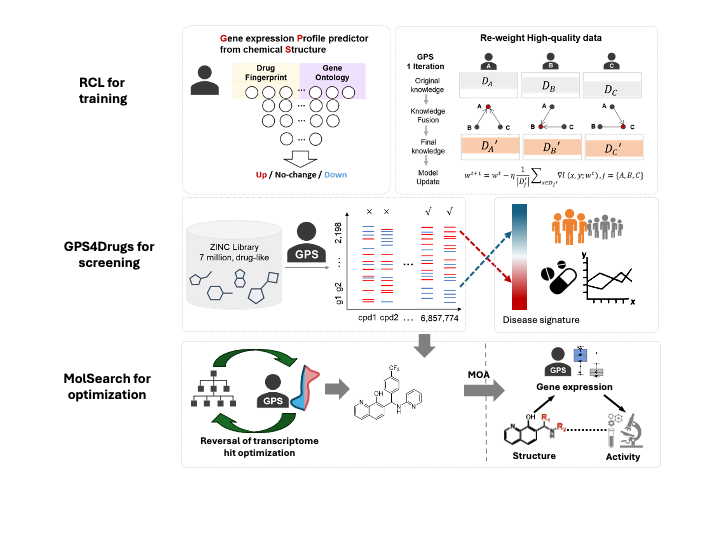

# GPS: an AI-platform for novel compound discovery using transcriptomics



## Background

Identifying drugs that reverse expression of disease-associated transcriptomic features has been widely explored as a strategy for discovering drug repurposing candidates, but its potential for novel compound discovery and optimization remains largely underexplored. We developed a deep learning-based platform that predicts gene expression changes from chemical structures, enabling high-throughput screening of large compound libraries. The platform refines compound scoring and employs a Monte Carlo Tree Search (MCTS) for multi-objective optimization and by incorporating Structure-Gene-Activity Relationships (SGAR), it can be used to uncover potential drug mechanisms directly from transcriptomic data, supporting both compound prioritization and lead optimization.

---

## About GPS and other Core Components

The **Gene expression profile Predictor on chemical Structures (GPS)** is an open-source platform under the Apache 2.0 Licence that allows researchers to predict the effects of chemical structures on gene expression, screen large-scale compound libraries, and optimize lead compounds for specific medicinal chemistry properties. Users can retrain models with their own data, and the platform is designed for community-driven improvements and adaptations.  

GPS consists of three core components:

- **RCL for training** – allows the user to retrain the model using custom drug/cell line data  
- **GPS4Drugs** – predict the effect of any structure on gene expression and screen drugs in custom or prescreened libraries  
- **MolSearch** – optimize chemical structures to improve multiple medicinal chemistry properties

---

## Repository


Clone the repository with:

```bash
git clone https://github.com/Bin-Chen-Lab/GPS/
```
Don't forget to download large files for each folder. See specific documentation in each folder.

---

## DockerHub Images

For ease of use, we provide DockerHub repositories:  

- [GPS4Drugs DockerHub](https://hub.docker.com/repository/docker/binchengroup/gpsimage/general)  
- [MolSearch DockerHub](https://hub.docker.com/repository/docker/binchengroup/molsearch)  

Detailed instructions on how to run Docker available inside respective folders.

---

## Online resources

Novel compound screening portal http://apps.octad.org/GPS/.

Drug repurposing web portal is available http://octad.org/ and the R package octad is available in Bioconductor. 

---

## GPS Documentation and Tutorial

Detailed documentation is available for each component within its respective folder.

An example of the workflow is available in the Tutorial folder.

---

## Figure generation code

The code in the [figure_code](https://github.com/Bin-Chen-Lab/GPS/tree/main/figure_code) folder is used to generate key figures in the paper

---

## Sequencing data

RNA-seq data are deposited in the GEO under accession number (GSE291867, GSE291190, and GSE291833). 

---

## Authors

Jing Xing, Mingdian Tan, Dmitry Leshchiner, Mengying Sun, Mohamed Abdelgied, Li Huang, Shreya Paithankar, Katie Uhl, Rama Shankar, Erika Lisabeth, Bilal Aleiwi, Tara Jager, Cameron Lawson, Ruoqiao Chen, Matthew Giletto, Reda Girgis, Richard R. Neubig, Samuel So, Edmund Ellsworth, Xiaopeng Li, Mei-Sze Chua, Jiayu Zhou, Bin Chen, Deep-learning-based de novo discovery and design of therapeutics that reverse disease-associated transcriptional phenotypes, Cell, 2026, ISSN 0092-8674, https://doi.org/10.1016/j.cell.2026.02.016

---

## Contact

If you have any questions please contact us at: contact@octad.org
