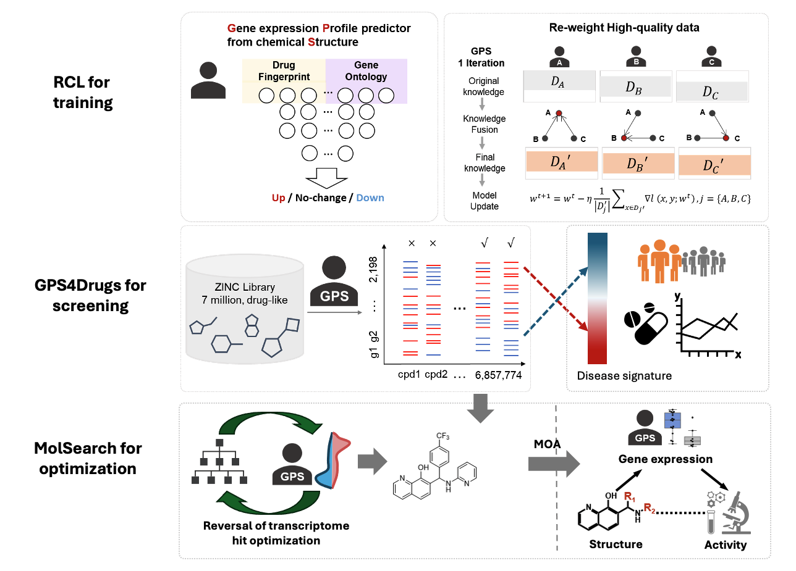

# Deep learning-based screening and design of novel therapeutics that reverse disease-associated transcriptional phenotype



## Abstract

Identifying drugs that reverse expression of disease-associated transcriptomic features has been widely explored as a strategy for discovering drug repurposing candidates, but its potential for novel compound discovery and optimization remains largely underexplored. Here, we present a deep learning-based drug discovery platform, guided by transcriptomic features, that screens large compound libraries and optimizes lead compounds. We first develop a model that predicts gene expression changes solely from chemical structures and deploy it to infer the expression changes of compounds in large screening libraries. We then refine compound scoring and employ a Monte Carlo Tree Search method for multi-objective optimization. By incorporating Structure-Gene-Activity Relationships, we uncover drug mechanisms directly from transcriptomic data. To demonstrate the utility of the system, we identify and validate compounds for hepatocellular carcinoma (HCC) and idiopathic pulmonary fibrosis (IPF). In HCC, we design a novel compound that improves the IC50 from 4 µM to 0.5 µM, with increased in vitro selectivity, favorable pharmacokinetics and in vivo activity. In IPF, we identify one repurposing candidate and one novel anti-fibrotic compound by reversing gene expression of mutiple distinct cell types derived from single cell transcriptomics.

---

## About GPS

The **Gene expression profile Predictor on chemical Structures (GPS)** is a set of software algorithms that allow for:

- Prediction of effects of chemical structures on gene expression  
- Screening of large-scale chemical libraries  
- Optimization of lead compounds for specific medicinal chemistry properties  

We published this code on GitHub to enable researchers to perform all of these tasks, as well as retrain the model using their own data. This code is open source to encourage the community to improve, adapt, and tailor this approach for their own needs, as well as to address wider scientific questions.

---

## Core Components

The GPS core software consists of 3 major components:

- **RCL for training** – retrain the model using your drug/cell line data  
- **GPS4Drugs** – predict the effect of any structure on gene expression and screen drugs in custom or prescreened libraries  
- **MolSearch** – optimize chemical structures to improve multiple medicinal chemistry properties  

---

## Repository

Clone the repository with:

```bash
git clone https://github.com/Bin-Chen-Lab/GPS/
```
---

## DockerHub Images

For ease of use, we provide DockerHub repositories:  

- [GPS4Drugs DockerHub](https://hub.docker.com/repository/docker/leshchi4/gpsimage/general)  
- [MolSearch DockerHub](https://hub.docker.com/repository/docker/leshchi4/molsearch)  

---

## GPS Documentation and Demo

Detailed documentation is available for each component within its respective folder.

A demo file is also available in the **`demo`** folder. 

This file is the recommended starting point, and together with the documentation, can be used as input to run each pipeline starting from the first step.

---

## Figure generation code

The code in the figure_code folder is used to generate key figures in the following paper:

Jing Xing, et. al., Deep learning-based screening and design of novel therapeutics that reverse disease-associated transcriptional phenotypes, submitted.

---

## Online resources

Novel compound screening portal http://apps.octad.org/GPS/.

Drug repurposing web portal is available http://octad.org/ and the R package octad is available in Bioconductor. 

---

## Sequencing data

RNA-seq data are deposited in the GEO under accession number (GSE291867, GSE291190, and GSE291833). 

---

## Authors

**Jing Xing¹#**, **Mingdian Tan²#**, **Dmitry Leshchiner¹˒³#**, **Mengying Sun⁴#**, **Mohamed Abdelgied¹#**,  
**Li Huang¹**, **Shreya Paithankar¹**, **Katie Uhl¹**, **Rama Shankar¹**, **Erika Lisabeth⁵**,  
**Bilal Aleiwi⁵**, **Tara Jager⁶**, **Cameron Lawson⁶**, **Ruoqiao Chen⁵**, **Reda Girgis⁶**, **Richard R. Neubig³˒⁵**,  
**Samuel So²**, **Edmund Ellsworth³˒⁵**, **Xiaopeng Li¹***, **Mei-Sze Chua²***,  
**Jiayu Zhou³˒⁴˒⁷***, **Bin Chen¹˒³˒⁴˒⁵\***  

¹ Department of Pediatrics and Human Development, College of Human Medicine, Michigan State University, Grand Rapids, MI 49503, USA  
² Asian Liver Center, Department of Surgery, School of Medicine, Stanford University, Stanford, CA, 94305, USA  
³ Center for AI-Enabled Drug Discovery, College of Human Medicine, Michigan State University, Grand Rapids, MI 49503, USA  
⁴ Department of Computer Science and Engineering, College of Engineering, Michigan State University, East Lansing, MI 48824, USA  
⁵ Department of Pharmacology and Toxicology, College of Human Medicine, Michigan State University, Grand Rapids, MI 49503, USA  
⁶ Corewell Health, Grand Rapids, MI 49503, USA  
⁷ School of Information, University of Michigan, Ann Arbor, MI 48109, USA  

**#: co-first authors**  
**\*: co-corresponding authors** — XL (lixiao@msu.edu), MC (mchua@stanford.edu), JZ (jiayuz@umich.edu), BC (chenbi12@msu.edu)
